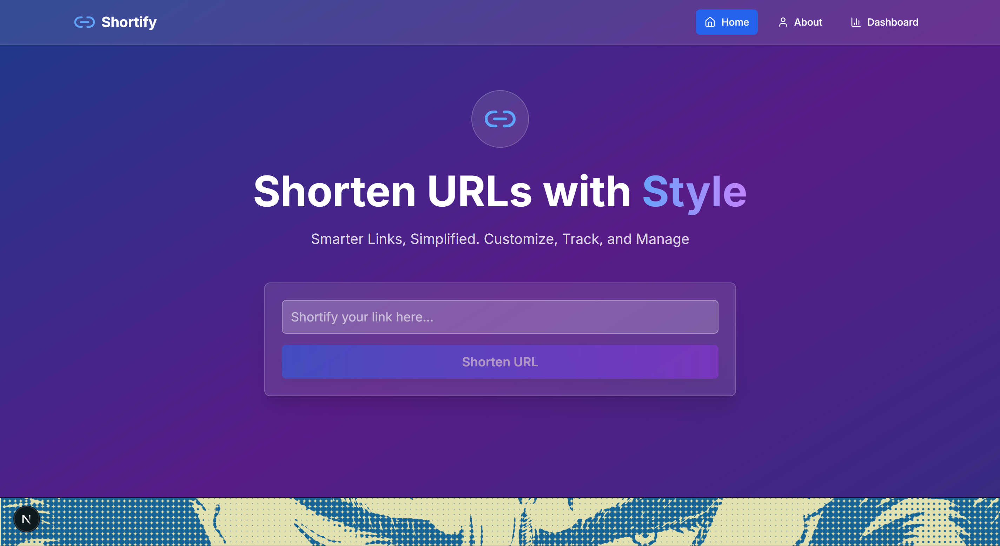
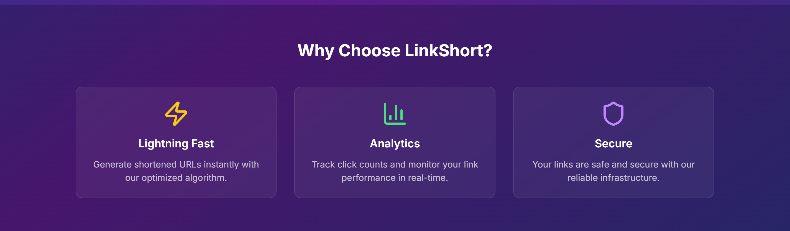
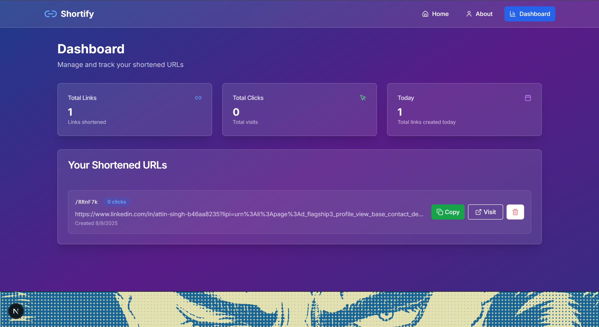

# 🔗 LinkShort — Modern URL Shortener (Next.js + Tailwind)


**LinkShort** is a sleek and modern URL shortener web app built with **Next.js 13+ (App Router)**, **Tailwind CSS**, and **TypeScript**. Designed to be minimal yet scalable, it takes long, ugly links and transforms them into clean, shareable short URLs.

---

## 📸 Preview

### 🏠 Homepage

  


### 📊 Dashboard



---

## 🚀 Features

- 🔗 Shortens long URLs into clean shortcodes
- ⚡ Built using Next.js App Router architecture
- 🎨 Styled with Tailwind CSS for responsiveness and speed
- 🧠 Modular structure using reusable components and hooks
- 📦 Scalable codebase ready for backend or API integration

---

## 🛠️ Tech Stack

- **Framework**: Next.js 13+ (App Router)
- **Language**: TypeScript
- **Styling**: Tailwind CSS, PostCSS
- **Tools**: ESLint, Git, VS Code

---

## 📂 Project Structure

```
project/
├── .bolt/                # Local Bolt or config files
├── .next/                # Build output (auto-generated)
├── app/                  # Next.js App directory
│   ├── [shortcode]/      # Dynamic routing for shortened links
│   ├── dashboard/        # Dashboard page
│   ├── layout.tsx        # Root layout wrapper
│   └── page.tsx          # Homepage
├── components/           # Reusable UI components
├── hooks/                # Custom React hooks
├── lib/                  # Utility functions
├── public/               # Static assets
├── styles/ or globals.css# Global styles
├── .eslintrc.json        # Linting rules
├── .gitignore            # Files to ignore in version control
├── package.json          # Project metadata & scripts
├── tailwind.config.ts    # Tailwind CSS configuration
├── tsconfig.json         # TypeScript configuration
└── next.config.js        # Next.js configuration
```

---

## 📦 Getting Started

1. **Clone the Repository**

```bash
git clone https://github.com/luciusji/LinkShort.git
cd LinkShort
```

2. **Install Dependencies**

```bash
npm install
```

3. **Run the Development Server**

```bash
npm run dev
```

4. Visit `http://localhost:3000` in your browser

---

## 🔧 Customization & API Integration

This starter project can be connected to any backend or shortening API (like TinyURL, Bitly, or your own Express server). The dynamic `[shortcode]` route is already set up and ready for redirection logic.

---

## ✅ To-Do / Future Features

- [ ] User authentication (for saved links)
- [ ] Click analytics / tracking
- [ ] Custom slugs for shortened URLs
- [ ] Shareable QR codes
- [ ] Deployment to Vercel or Netlify

---

## 📄 License

This project is licensed under the MIT License — feel free to fork and build on it.

---

## 💬 Contact

Want to give feedback or collaborate?

- GitHub: [github.com/luciusji](https://github.com/luciusji)
- Email: aarushmishrashitalaprasad@gmail.com

---

_Built with 💙 by Aarush_
