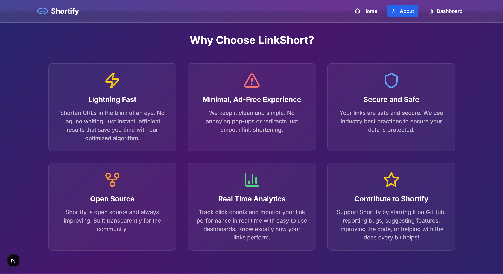

# 🔗 Shortify — Modern URL Shortener (Next.js + Tailwind)


**LinkShort** is a sleek and modern URL shortener web app built with **Next.js 13+ (App Router)**, **Tailwind CSS**, and **TypeScript**. Designed to be minimal yet scalable, it takes long, ugly links and transforms them into clean, shareable short URLs.

---

## 📸 Preview

### 🏠 Homepage

  


### 📊 Dashboard


---

## 🚀 Features

- 🔗 Shortens long URLs into clean shortcodes
- ⚡ Built using Next.js App Router architecture
- 🎨 Styled with Tailwind CSS for responsiveness and speed
- 🧠 Modular structure using reusable components and hooks
- 📦 Scalable codebase ready for backend or API integration

---

## 🛠️ Tech Stack

- **Framework**: Next.js 13+ (App Router)
- **Language**: TypeScript
- **Styling**: Tailwind CSS, PostCSS
- **Tools**: ESLint, Git, VS Code

---

## 📂 Project Structure

```
project/
|
├── .next/ # Build output (auto-generated)
├── .env.local # Env vars (e.g., NEXT_PUBLIC_BASE_URL)
├── app/ # Next.js App Router
│ ├── [shortcode]/ # Dynamic route for short links (redirect logic)
│ │ └── page.tsx
│ ├── dashboard/
│ │ └── page.tsx # Your Dashboard (uses storage + env base URL)
│ ├── privacy-policy/
│ │ └── page.tsx # Privacy Policy page
│ ├── terms-of-service/
│ │ └── page.tsx # Terms of Service page
│ ├── cookie-policy/
│ │ └── page.tsx # Cookie Policy page
│ ├── layout.tsx # Root layout (include <Footer /> or per-page)
│ └── page.tsx # Homepage
├── components/
│ ├── footer.tsx # Footer with links to legal pages
│ ├── stats-card.tsx # StatsCard used on dashboard
│ └── ui/
│ ├── badge.tsx
│ ├── button.tsx
│ └── card.tsx
├── hooks/ # Custom hooks (if any)
├── lib/
│ ├── storage.ts # localStorage CRUD for URLs
│ ├── url-shortener.ts # ShortenedUrl type and UrlShortener class
│ └── url.ts # (optional) getShortUrl helper
├── public/
│ └── guts.png # Static assets
├── styles/ # Global styles folder (or)
│ └── globals.css
├── .eslintrc.json
├── .gitignore
├── next.config.js
├── package.json
├── tailwind.config.ts
└── tsconfig.json
```

## 📦 Getting Started

1. **Clone the Repository**

```bash
git clone https://github.com/A4rush/Shortify.git
cd SHORTIFY
```

2. **Install Dependencies**

```bash
npm install
```

3. **Run the Development Server**

```bash
npm run dev
```

4. Visit `http://localhost:3000` in your browser

---

## 🔧 Customization & API Integration

This starter project can be connected to any backend or shortening API (like TinyURL, Bitly, or your own Express server). The dynamic `[shortcode]` route is already set up and ready for redirection logic.

---

## ✅ To-Do / Future Features

- [ ] User authentication (for saved links)
- [ ] Click analytics / tracking
- [ ] Custom slugs for shortened URLs
- [ ] Shareable QR codes
- [ ] Deployment to Vercel or Netlify

---

## 📄 License

This project is licensed under the MIT License — feel free to fork and build on it.

---

## 💬 Contact

Want to give feedback or collaborate?

- GitHub: [github.com/A4rush](https://github.com/A4rush)
- Email: aarushmishrashitalaprasad@gmail.com

---

Developed by Aarush.
